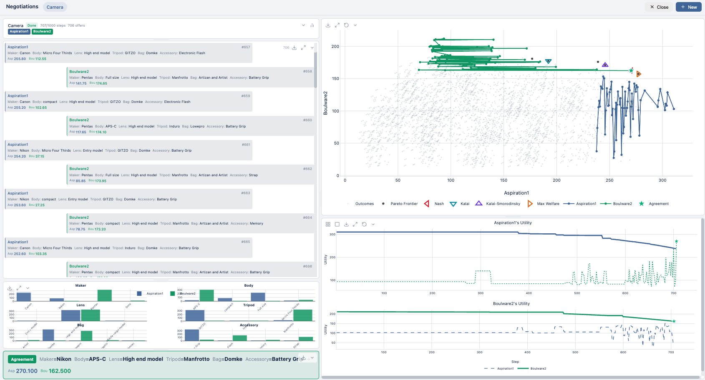

# NegMAS App

**A Visual Interface for Automated Negotiation**

NegMAS App is a modern web-based GUI for the [NegMAS](https://github.com/yasserfarouk/negmas) automated negotiation library. It provides an intuitive interface for running, visualizing, and analyzing automated negotiations using Vue.js and FastAPI.



!!! info "AI-Assisted Development"
    This project was designed by humans but primarily implemented by AI (Claude Opus 4 and [OpenCode](https://opencode.ai)). The architecture, features, and design decisions were made by the maintainers, while the bulk of the code was generated through AI-assisted development.

## Key Features

### Real-time Negotiation Visualization

Watch negotiations unfold step-by-step with live updates:

- **2D Utility Space**: Visualize offers in the utility space with Pareto frontier, Nash point, Kalai point, and reserved values
- **Utility Timeline**: Track how utilities evolve over negotiation rounds
- **Offer History**: See the complete history of offers with utility values
- **Issue Space 2D**: Distribution of offers across any two issues
- **Histogram**: Analyze the distribution of proposed values per issue
- **Result Analysis**: Compare outcomes against Nash, Kalai, KS, and welfare optima

### Tournament System

Run round-robin tournaments to compare negotiation strategies:

- **Competition Grid**: Real-time progress grid showing all matchups with color-coded status
- **Live Leaderboard**: Watch rankings update as negotiations complete with medals for top 3
- **Negotiations Panel**: Browse all tournament negotiations with utilities and completion status
- **Click to View**: Click any negotiation cell or item to view full details
- **Save/Load**: Persistent storage for completed tournaments

### Scenario Management

Browse and analyze 279 ANAC competition scenarios (2010-2022):

- **Scenario Explorer**: Browse scenarios with search and filtering
- **Statistics Display**: View Pareto frontiers, Nash/Kalai/KS points, welfare optima
- **Quick Start**: Launch negotiations directly from the explorer
- **Import/Export**: Import scenarios from files or export existing ones

### Negotiator Support

Work with a wide variety of negotiation agents:

- **Native NegMAS Agents**: All built-in negotiators (Aspiration, TitForTat, Boulware, etc.)
- **Genius Agents**: ANAC competition agents via Genius Bridge
- **Custom Parameters**: Configure negotiator-specific settings with documentation

## Documentation Structure

### [User Guide](user-guide/index.md)

For users who want to run negotiations and analyze results:

- [Running Negotiations](user-guide/negotiations.md) - Configure and run single negotiations
- [Running Tournaments](user-guide/tournaments.md) - Compare strategies across scenarios
- [Scenario Explorer](user-guide/scenarios.md) - Browse and manage negotiation scenarios
- [Negotiator Explorer](user-guide/negotiators.md) - Discover and configure negotiation agents

### [Developer Guide](developer-guide/index.md)

For developers who want to understand or extend the application:

- [Architecture Overview](developer-guide/architecture.md) - System design and data flow
- [Code Structure](developer-guide/code-structure.md) - Project organization and components
- [Creating Panels](developer-guide/creating-panels.md) - How to add new visualization panels
- [API Reference](developer-guide/api.md) - Backend REST API documentation
- [Contributing](developer-guide/contributing.md) - How to contribute to the project

## Quick Start

```bash
# Install
pip install negmas-app

# First-time setup (extract scenarios)
negmas-app setup

# Run (opens browser at http://127.0.0.1:5174)
negmas-app start
```

See the [Installation Guide](getting-started/installation.md) for detailed instructions.

## Technology Stack

| Component | Technology | Purpose |
|-----------|------------|---------|
| Frontend | Vue 3 | Reactive UI components |
| State | Pinia | Centralized state management |
| Routing | Vue Router | Client-side navigation |
| Build | Vite | Fast development and builds |
| Charts | Plotly.js | Interactive visualizations |
| Backend | FastAPI | REST API and SSE streaming |
| Real-time | SSE | Server-to-client updates |

## Citation

If you use NegMAS App in your research, please cite:

```bibtex
@inproceedings{mohammad2023negmas,
  title={NegMAS: A Platform for Situated Negotiations},
  author={Mohammad, Yasser and Greenwald, Amy and Nakadai, Shinji},
  booktitle={Proceedings of the 2023 International Conference on Autonomous Agents and Multiagent Systems},
  year={2023}
}
```

## Quick Links

<div class="grid cards" markdown>

-   :material-download:{ .lg .middle } **Getting Started**

    ---

    Install NegMAS App and run your first negotiation

    [:octicons-arrow-right-24: Installation](getting-started/installation.md)

-   :material-play-circle:{ .lg .middle } **User Guide**

    ---

    Learn how to run negotiations and tournaments

    [:octicons-arrow-right-24: User Guide](user-guide/index.md)

-   :material-code-braces:{ .lg .middle } **Developer Guide**

    ---

    Understand the architecture and extend the app

    [:octicons-arrow-right-24: Developer Guide](developer-guide/index.md)

-   :material-trophy:{ .lg .middle } **Tournaments**

    ---

    Compare strategies in round-robin tournaments

    [:octicons-arrow-right-24: Running Tournaments](user-guide/tournaments.md)

</div>

## Related Projects

- [NegMAS](https://github.com/yasserfarouk/negmas) - The underlying negotiation library
- [SCML](https://github.com/yasserfarouk/scml) - Supply Chain Management League
- [Genius](http://ii.tudelft.nl/genius/) - Negotiation environment (for Genius agents)

## License

NegMAS App is open source software licensed under the MIT license.
