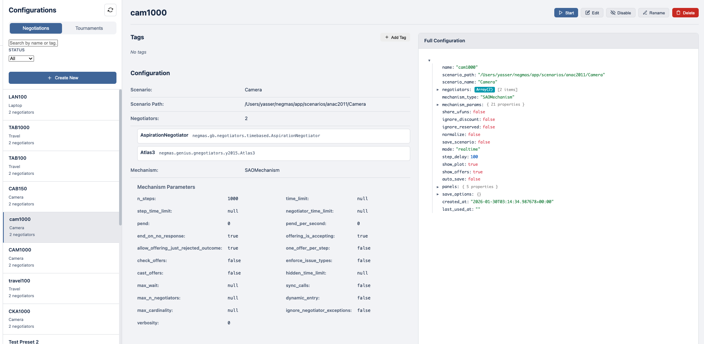
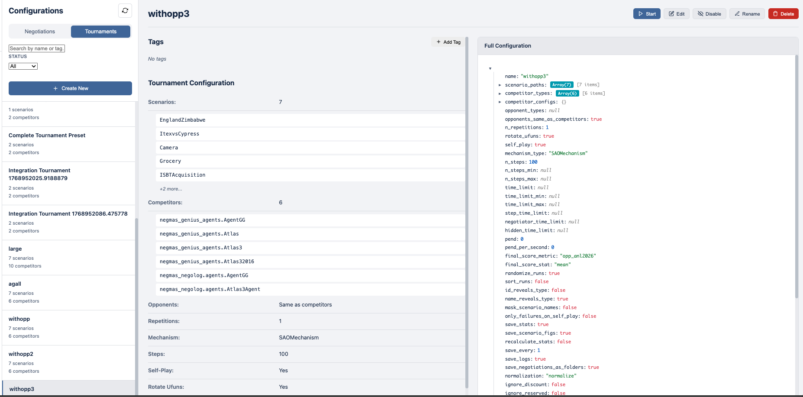

# Configuration Manager

The Configuration Manager allows you to save, organize, and reuse negotiation and tournament configurations.

## Accessing the Manager

Click **Configs** in the sidebar navigation.

## Interface Overview

The Configs page displays saved configurations in two tabs:

### Negotiation Configurations

Saved negotiation setups including:

- **Scenario**: The negotiation domain
- **Negotiators**: Selected agents and their parameters
- **Mechanism settings**: Steps, time limits, etc.

### Tournament Configurations

Saved tournament setups including:

- **Scenarios**: Selected negotiation domains
- **Competitors**: Negotiators competing for ranking
- **Opponents**: Fixed opponents (optional)
- **Settings**: Repetitions, rotation, scoring method

## Saving Configurations

### From New Negotiation Modal

1. Configure your negotiation in the New Negotiation wizard
2. Click **Save Configuration** before starting
3. Enter a name for the configuration
4. The configuration is saved for later reuse

### From New Tournament Modal

1. Configure your tournament in the wizard
2. Click **Save Configuration** 
3. Enter a name for the configuration
4. Access it later from the Configs page

## Using Saved Configurations

### Quick Start

1. Go to the Configs page
2. Find your saved configuration
3. Click **Use** to open it in the appropriate wizard
4. Modify if needed, then start

### Duplicating Configurations

1. Click the duplicate icon on any configuration
2. A copy is created with "(copy)" suffix
3. Edit the copy as needed

### Deleting Configurations

1. Click the delete icon on any configuration
2. Confirm deletion
3. The configuration is permanently removed

## Configuration Details

Click any configuration to view its details:

- Full scenario information
- Negotiator parameters
- All mechanism settings
- Creation date and last used

## Tips

- **Save successful setups**: When you find a good configuration, save it for future experiments
- **Use descriptive names**: Include key details like "Boulware vs Conceder - ANAC2019"
- **Organize by purpose**: Group related configurations with similar naming conventions
