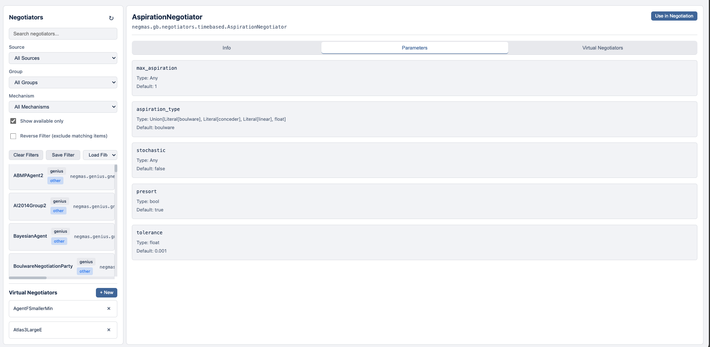

# Negotiator Explorer

The Negotiator Explorer provides a comprehensive interface for discovering, browsing, and configuring negotiation agents available in the system.

## Overview

Access the Negotiator Explorer by clicking **Negotiators** in the header navigation. The explorer displays all available negotiation agents from various sources including native NegMAS agents, Genius agents from ANAC competitions, and custom user-defined agents.

## Interface Layout

The explorer uses a two-panel layout:

### Left Panel: Negotiator List

- **Search**: Filter negotiators by name
- **Source Filter**: Filter by source (Native, Genius, Virtual)
- **Group Filter**: Filter by group (Core, ANAC years, etc.)
- **Results List**: Scrollable list of matching negotiators

### Right Panel: Negotiator Details

When you select a negotiator, the right panel shows:

- **Overview**: Source, group, and full type name
- **Description**: Agent documentation (when available)
- **Tags**: Classification tags (e.g., anac-2019, winner, finalist)
- **Mechanisms**: Supported negotiation mechanisms
- **Parameters**: Configurable parameters with types and defaults

## Sources

Negotiators come from several sources:

| Source | Description |
|--------|-------------|
| **Native** | Built-in NegMAS negotiators |
| **Genius** | Agents from the Genius platform (ANAC competitions) |
| **Virtual** | User-saved configurations with custom parameters |
| **LLM** | Large language model-based negotiators |
| **RL** | Reinforcement learning negotiators |
| **NegoLog** | Logic-based negotiators |
| **Custom** | User-provided Python modules |

## Groups

Negotiators are organized into groups:

- **Core**: Fundamental negotiators (Random, Aspiration, etc.)
- **ANAC 20XX**: Competition agents from specific years
- **Other**: Miscellaneous agents

## Filtering

Use the filters to narrow down the list:

1. **Search**: Type part of the negotiator name
2. **Source**: Select a specific source
3. **Group**: Select a competition year or category

Filters work together - selecting both "Genius" source and "ANAC 2019" group shows only Genius agents from the 2019 competition.

## Viewing Details

Click any negotiator to view its details:

### Tags

Tags provide quick classification:

- `winner` - Competition winner
- `finalist` - Competition finalist
- `anac-YYYY` - Competition year
- `builtin` - Built into NegMAS
- `can-propose` - Can make proposals
- `can-respond` - Can respond to proposals

### Supported Mechanisms

Shows which negotiation protocols the agent supports:

- **SAO** - Stacked Alternating Offers
- **TAU** - Time-based Alternating Ultimatums
- **GB** - General Bargaining

### Parameters

Lists all configurable parameters with:

- Parameter name
- Type (bool, int, float, str, Literal)
- Default value
- Description (when available)

## Creating Virtual Negotiators

Virtual negotiators let you save custom parameter configurations for reuse.

### Steps to Create

1. Select a base negotiator
2. Configure parameters in the Parameters section
3. Enter a name in "Virtual Negotiator Name"
4. Click **Save as Virtual**

### Parameter Configuration

- **Boolean**: Select True, False, or Default
- **Numbers**: Enter a value or leave blank for default
- **Strings**: Enter text or leave blank for default
- **Enums**: Select from available options

### Using Virtual Negotiators

Saved virtual negotiators:

- Appear in the negotiator list with "Virtual" source
- Can be used in negotiations and tournaments
- Include a "virtual" tag automatically
- Store parameter overrides only (not base class code)

## Agent Categories

### Native Negotiators

Built-in NegMAS agents include:

- **AspirationNegotiator**: Time-based concession
- **NaiveTitForTatNegotiator**: Reciprocal strategy
- **BoulwareNegotiator**: Tough early, concede late
- **ConcederNegotiator**: Concede early, tough late
- **LinearNegotiator**: Linear concession
- **RandomNegotiator**: Random offer selection

### BOA Negotiators

Behavior-Opponent-Acceptance architecture allows composing custom agents from:

- **Acceptance Strategy**: When to accept offers
- **Offering Strategy**: How to generate offers  
- **Opponent Model**: How to model opponent behavior

### MAP Negotiators

Model-Acceptance-Policy architecture supports:

- Multiple strategy models
- Multiple acceptance criteria
- Configurable policy ordering

### Genius Agents

ANAC competition agents available via the Genius Bridge:

- Require Java and Genius to be installed
- Bridge auto-starts when needed
- Full agent behavior from original competition code

## Tips

1. **Use tags to find winners**: Filter by "winner" tag to see competition-winning agents

2. **Check mechanism support**: Ensure the agent supports your chosen mechanism before using

3. **Start with defaults**: Try agents with default parameters first, then customize

4. **Save configurations**: Use virtual negotiators to save successful parameter combinations

5. **Compare agents**: Run tournaments to compare agent performance across scenarios

## Related Topics

- [Running Negotiations](negotiations.md) - Using negotiators in negotiations
- [Running Tournaments](tournaments.md) - Comparing negotiators
- [Scenario Explorer](scenarios.md) - Finding scenarios to test agents
