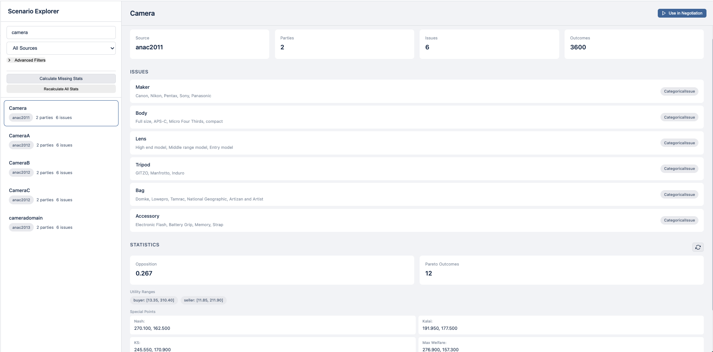
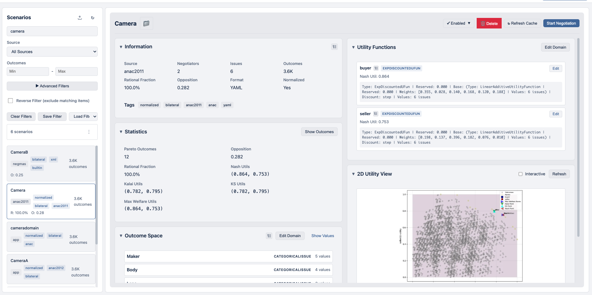
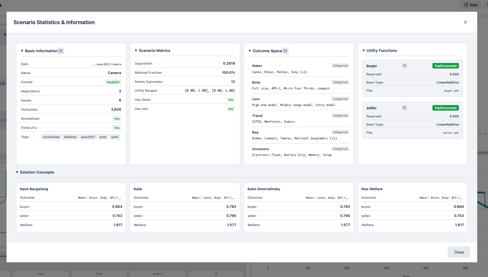

# Scenario Explorer

The Scenario Explorer allows you to browse, analyze, and import negotiation scenarios.



## Accessing the Explorer

Click **Scenarios** in the sidebar navigation.

## Interface Overview

The Scenario Explorer displays all available scenarios in a searchable, filterable list.

### Search and Filters

- **Search**: Filter by scenario name
- **Source Filter**: Filter by ANAC year or source (e.g., "ANAC 2015", "imported")
- **Tags**: Filter by scenario tags

### Scenario List

Each scenario card shows:

- **Name**: Scenario identifier
- **Source**: Origin (ANAC year, custom, etc.)
- **Issues**: Number of negotiation issues
- **Outcomes**: Total possible outcomes

### Scenario Details

Click any scenario to view detailed information:



- **Issue definitions**: Names, types, and value ranges
- **Utility function info**: Type and characteristics
- **Statistics**: Pareto frontier, Nash point, etc. (if cached)

## Viewing Statistics

Click the **stats icon** (📊) on a scenario to open the Statistics Modal:



### Statistics Display

| Statistic | Description |
|-----------|-------------|
| **Pareto Frontier** | Set of optimal trade-off outcomes |
| **Nash Point** | Nash bargaining solution |
| **Kalai Point** | Kalai-Smorodinsky solution |
| **KS Point** | Alternative Kalai-Smorodinsky |
| **Max Welfare** | Maximum social welfare point |
| **Opposition** | How opposed the parties' interests are |

### Opposition vs Outcomes Plot

Visualizes the relationship between opposition score and number of outcomes across scenarios.

## Using Scenarios

### Start a Negotiation

1. Click on a scenario
2. Click **Use in Negotiation**
3. Configure negotiators and start

### Start from Stats Modal

1. Open scenario statistics
2. Click **Use in Negotiation**
3. Scenario is pre-selected in the wizard

## Importing Scenarios

### Import Button

Click the **import icon** (📥) to open the Import Modal.

### Import Sources

| Source Type | Description |
|-------------|-------------|
| **Folder** | Directory containing scenario files |
| **Zip Archive** | Compressed scenario package |
| **Single File** | YAML, XML, or JSON scenario file |

### Import Steps

1. **Browse**: Use the file/folder picker or paste a path
2. **Validate**: Click validate to check the scenario
3. **Configure**:
   - Enter a name (auto-suggested from file)
   - Enable/disable stats calculation
   - Enable/disable preview image generation
4. **Import**: Click Import to add the scenario

### Import Options

| Option | Description |
|--------|-------------|
| **Calculate Statistics** | Compute Pareto, Nash, etc. on import |
| **Generate Previews** | Create preview images for faster loading |

### Import Location

Imported scenarios are saved to `~/negmas/app/scenarios/imported/` with:

- Scenario files in negmas native YAML format
- Original path and format stored in `_info.yaml`
- "imported" tag automatically added

## Scenario Sources

| Source | Description |
|--------|-------------|
| **ANAC 2010-2022** | Competition scenarios from each year |
| **Custom** | User-added scenarios |
| **Imported** | Scenarios imported via the Import feature |
| **Examples** | Built-in example scenarios |

## Scenario Format

Scenarios are stored as directories with:

```
my_scenario/
├── domain.yaml        # Issue definitions
├── ufun_0.yaml       # Party 0 utility function
├── ufun_1.yaml       # Party 1 utility function
├── _info.yaml        # Metadata (optional)
└── _stats.yaml       # Cached statistics (optional)
```

### Domain File

```yaml
name: "My Scenario"
issues:
  - name: "Price"
    type: "discrete"
    values: ["Low", "Medium", "High"]
  - name: "Quality"
    type: "integer"
    min: 1
    max: 10
```

### Utility Function File

```yaml
ufun_type: "linear_additive"
weights:
  Price: 0.6
  Quality: 0.4
values:
  Price:
    Low: 0.0
    Medium: 0.5
    High: 1.0
  Quality: "linear"  # Linear from min to max
reserved_value: 0.0
```

## Adding Custom Scenario Paths

1. Open **Settings** (gear icon)
2. Go to **Paths** section
3. Add custom scenario directories
4. Click **Refresh** in scenario explorer

## Tips

- **Use statistics**: Check opposition scores to find challenging scenarios
- **Filter by year**: ANAC scenarios from the same year often have similar characteristics
- **Cache statistics**: Enable caching in settings for faster scenario browsing
- **Import from Genius**: You can import Genius XML scenarios directly
